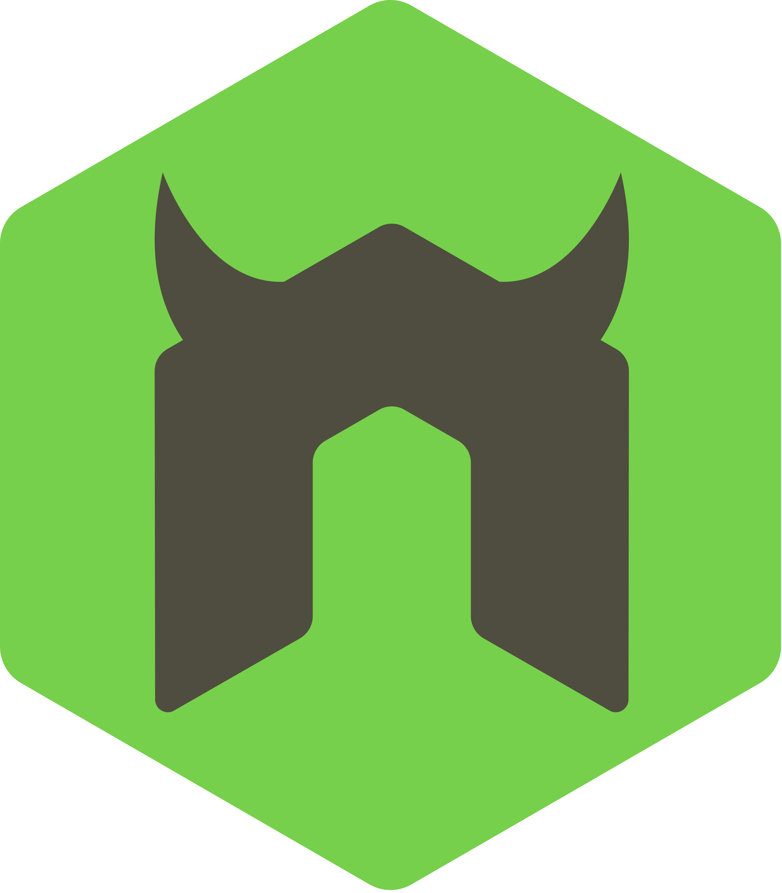

# Game-Backend-Deploy

GENERA Project: Server Side Codebase <br />
This code is responsible for creating a Web Server and handling incoming HTTP requests from the Genera's Online Multiplayer Game.

## Technologies

This Web Server is created by utilizing the power of the **Express.js** framework. Constructed using the JavaScript programming language, it requires the use of the **Node.js runtime** environment in order to run.
<br />

Furthermore, this application utilizes a **MySQL database** to persistently store all essential data required for the game's operation.
<br />

 &nbsp;
 &nbsp;&nbsp;
 &nbsp;&nbsp;
<br />

As Express.js is an un-opinionated framework, it **requires certain packages** to be installed to extend its functionality. The most important are listed below:
<br />

 &nbsp;&nbsp;&nbsp;&nbsp;
 &nbsp;
 &nbsp;
 &nbsp;&nbsp;&nbsp;&nbsp;
 &nbsp;&nbsp;&nbsp;&nbsp;
 &nbsp;&nbsp;
 &nbsp;&nbsp;

- **Nodemon** (A utility that automatically restarts a Node.js application when file changes are detected)
- **Cookie-Parser** (A middleware module for Node.js that is used to parse cookies attached to the client request, making it easy to manage client-side data in server-side code)
- **bcrypt** (A library for Node.js providing cryptographic functionality, particularly password hashing, to help securely store passwords in a database)
- **CORS** (A mechanism that allows resources (e.g., fonts, JavaScript, etc.) on a web page to be requested from another domain, outside the domain from which the resource originated)
- **dotenv** (A module for Node.js that loads environment variables from a .env file into process.env, making them available throughout your application)
- **Json Web Token (JWT)** (A compact, URL-safe means of representing claims to be transferred between two parties, often used for authentication and information exchange in web applications)
- **ESLint** (A pluggable and configurable linter tool for identifying and reporting on patterns in JavaScript code)
  <br />

## Application's Structure

The application consists of 5 parts.

1.  **_server.js_** (Starting Point)<br />
    This file is critical because it is where all requisite modules are imported, middleware functions are initialized, and API routes are defined, thus serving as the backbone of the application structure.

2.  **_routes_** (Implementing Logic for API Routes)<br />
    In this directory, each file represents a unique REST API route. Inside every file lays the code responsible for handling the incoming requests for the specific route.

3.  **_subControllers_** (Encapsulating Route Functionality) - Located at: (controllers/subController)<br />
    Controllers are instrumental in enhancing code visibility, reducing duplication, and facilitating scalability by encapsulating each route's functionality within separate, dedicated files.

4.  **_dbFunctions_** (Interacting with the Database) - Located at: (model/sqlQueries/dbFunctions.js)<br />
    This file contains a collection of custom fuctions used by the Controllers in order to interact with the MySQL Database. Usually, developers tend to use "ORMs" which are libraries created for this specific purpose. However, I wished to better understand how the SQL language worked therefore created a simple mini ORM library particulary for this project. Listed below are the available functions:

```javascript

const getStaff = (req, res, table, indentifier, select = "*", specialCase)

```

```javascript

const getSpecificStaff = (req, res, table, indentifier = "id", value)

```

```javascript

const postStaff = (req, res, to, requiredFields)

```

```javascript

const putStaff = (req, res, to, requiredFields, indentifier = "id")

```

```javascript

const deleteStaff = (req, res, table, indentifier = "id")

```

```javascript

function getEverything(req, res, table, Identifier)

```

5.  **_config_** (Application's Configuration Settings)<br />
    This directory houses numerous critical settings that dictate the behavior of the application, playing a crucial role in its overall functionality.
    The most noteworthy are listed below: - **dbConfig.js**: Contains the Database's connection details - **allowedOrigins.js**: Holds a collection of the Origins that can use the application's API (ex. "https://master--genera-game-testing.netlify.app") - **tables**: This directory contains files employed during calls to dbFunctions, defining the requisite properties that the request body must carry for successful acceptance

## About Docker

### Commands Cheatsheet

Make sure Docker is running!
This the assosiated error:

`ERROR: error during connect: Head "http://%2F%2F.%2Fpipe%2FdockerDesktopLinuxEngine/_ping": open //./pipe/dockerDesktopLinuxEngine: The system cannot find the file specified.`

- _Building an Image_: `docker build -f Dockerfile.whatever -t your-image-name .`
- Pushing Image to DockerHub:

  - Authentication: `docker login`
  - Tag the Image: `docker tag your-image-name username/your-image-name:your-tag`
  - Push the Image: `docker push username/your-image-name:your-tag`

- Running a Container: `docker run --env-file path/to/.env -p <host-port>:<web-server-port> your-image-name`
- Creating a Volume: `docker volume create my_data_volume`
- Mounting a Volume to a Container: `docker run -d --name my_container_name -v my_data_volume:/path/to-mount-volume-in-container/ username/your-image-name:your-tag` (Typically, you will have a assinged a WORKDIR in your Dockerfile named "/app". So you could mount the Volume at: "/app/my_app_files/)

### Testing

Once the Container is running, you can test the following by using a Browser or API Client (ex. Postman, Bruno, etc.):

- Server Running Correctly: `http://localhost:<host-port>/` (Expected Output: "If this stylish page appears, means that the backend is probably working :D")
- Database Connection: `http://localhost:<host-port>/players` (Expected Output: a JSON Array containing all the players in the Database)
- Mini Quiz Game: `http://localhost:<host-port>/quiz-questions` (Expected Output: a JSON object with all the questions in the Database, reload the page to get a new set of questions)
